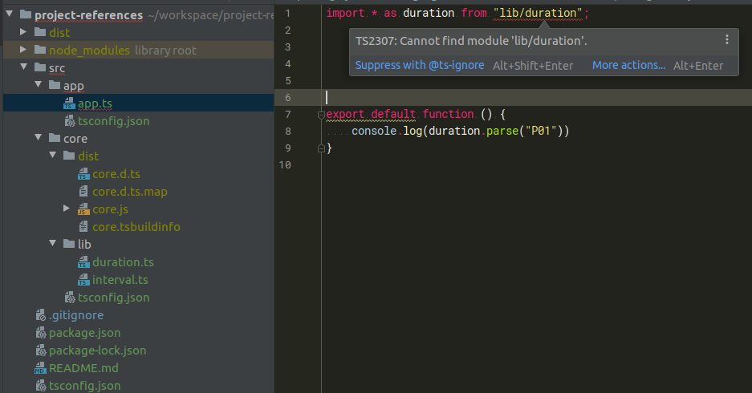

```bash
npm install
npm run build
```

# Expectation
After a successful build the typings of `src/core` are available and my IDE should be able to resolve imports in `src/app` using the referenced composite project.



